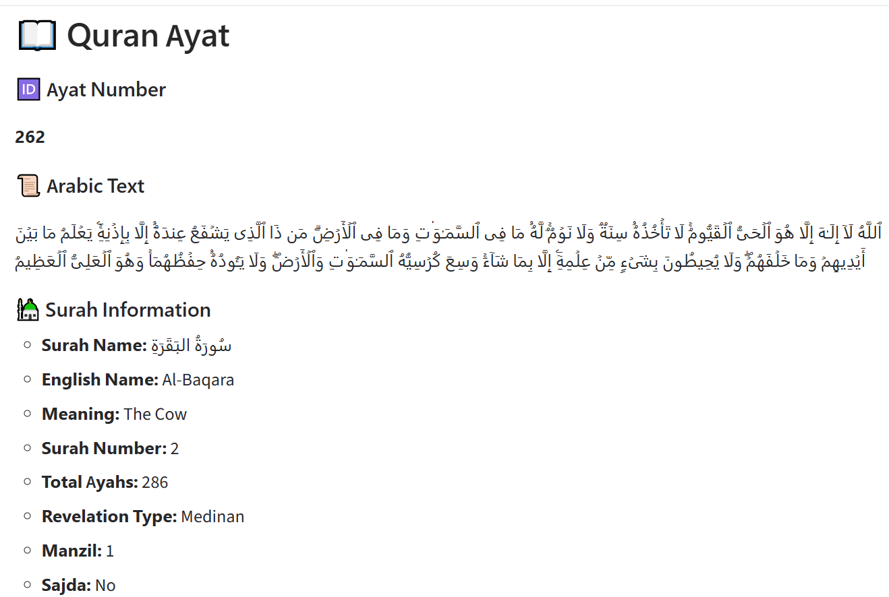

# 📖 Quran Ayat Finder

<p align="center">
  
  
  
  
</p>

<p align="center">
A simple yet elegant <b>Gradio Web Application</b> that allows users to search any Quran Ayat by its global Ayat number using the <b>AlQuran Cloud API</b>.
</p>

---

# ✨ Features

✅ Search any Quran Ayat by its global Ayat Number

✅ Display the Arabic text of the Ayat

✅ View complete Surah information

- 🕌 Surah Name
- 🌍 English Name
- 📖 English Meaning
- 🔢 Surah Number
- 📑 Total Ayahs
- 🌙 Revelation Type
- 📍 Manzil
- 🤲 Sajda Information

✅ Beautiful Markdown output

✅ Reset button

✅ Press **Enter** to search instantly

✅ User-friendly interface

✅ Proper error handling

---

# 🖼️ Application Preview

## 🏠 Home Page

<p align="center">
  
</p>

```
screenshots/home.png
```

---

## 📄 Search Result

<p align="center">
  
</p>

```
screenshots/output.png
```

---

# 🚀 Live Demo

[(Try it)](https://hamza0972-quran-ayat-finder.hf.space)

---

# 📂 Project Structure

```
quran-ayat-finder/
│
├── app.py
├── requirements.txt
├── README.md
├── LICENSE
├── .gitignore
└── screenshots/
      ├── home.png
      └── output.png
```

---

# 🛠️ Built With

- 🐍 Python
- 🎨 Gradio
- 🌐 Requests
- 📖 AlQuran Cloud REST API

---

# ⚙️ Installation

Clone the repository

```bash
git clone https://github.com/yourusername/quran-ayat-finder.git
```

Move into the project

```bash
cd quran-ayat-finder
```

Install dependencies

```bash
pip install -r requirements.txt
```

Run the application

```bash
python app.py
```

The application will launch in your browser.

---

# 📋 Requirements

```
Python 3.10+
Gradio
Requests
```

Or install using

```bash
pip install gradio requests
```

---

# 📖 How to Use

1️⃣ Enter any Quran Ayat Number.

Examples:

```
1
255
6236
```

2️⃣ Click the **🔍 Search** button or simply press **Enter**.

3️⃣ View:

- Arabic Ayat
- Surah Name
- English Name
- Meaning
- Revelation Type
- Manzil
- Sajda Status

4️⃣ Press **🔄 Reset** to clear everything.

---

# 🌐 API Used

This project uses the free **AlQuran Cloud API**.

Example Endpoint:

```
https://api.alquran.cloud/v1/ayah/255
```

---

# 💡 Example Output

```
Ayat Number: 255

Arabic Text:
اللَّهُ لَا إِلَٰهَ إِلَّا هُوَ الْحَيُّ الْقَيُّومُ...

Surah:
Al-Baqarah

Meaning:
The Cow

Revelation:
Medinan

Sajda:
No
```

---

# 📌 Future Improvements

- 🌍 English Translation
- 🇵🇰 Urdu Translation
- 🔊 Audio Recitation
- 📖 Tafsir
- ⭐ Bookmark Ayats
- 📋 Copy Ayat Button
- 🌙 Dark Mode
- 🎲 Random Ayat
- 🔎 Search by Surah Name
- 🔢 Search using Surah:Ayah format (2:255)

---

# 🤝 Contributing

Contributions are welcome!

If you have ideas to improve this project:

- Fork the repository
- Create a new branch
- Make your changes
- Submit a Pull Request

---

# ⭐ Support

If you found this project helpful, please consider giving it a ⭐ on GitHub.

It helps others discover the project and motivates future improvements.

---

# 👨‍💻 Author

**Muhammad Hamza**

🎓 BS Computer Science Student

🤖 AI & Machine Learning Enthusiast

📊 Data Analytics & Python Developer

🌍 Pakistan

---

# 📄 License

This project is licensed under the MIT License.

Feel free to use, modify, and share it.

---

<p align="center">
Made with ❤️ using Python, Gradio, and the AlQuran Cloud API.
</p>
